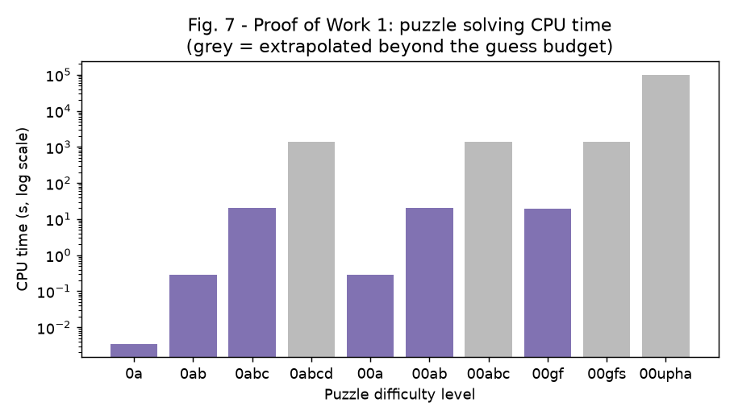
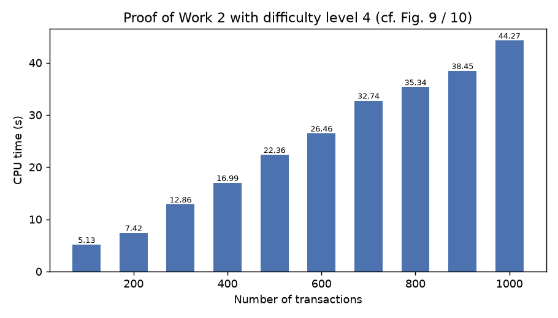
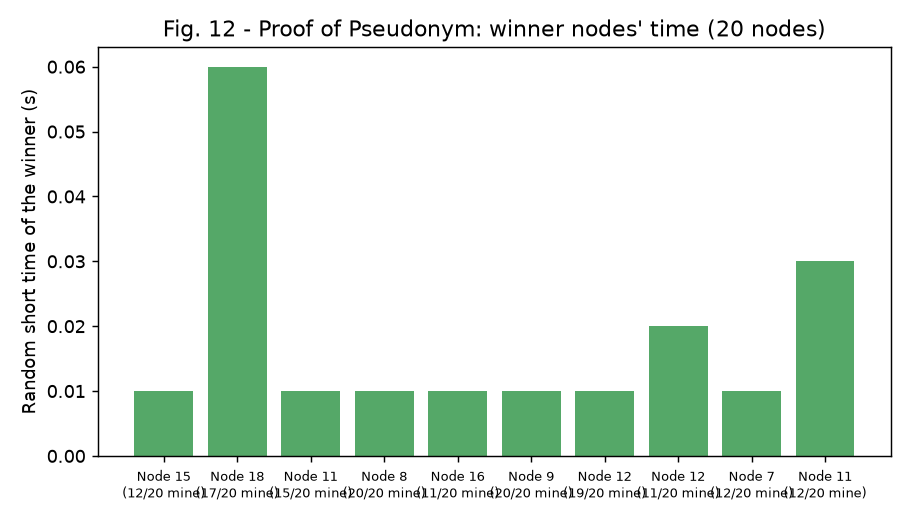
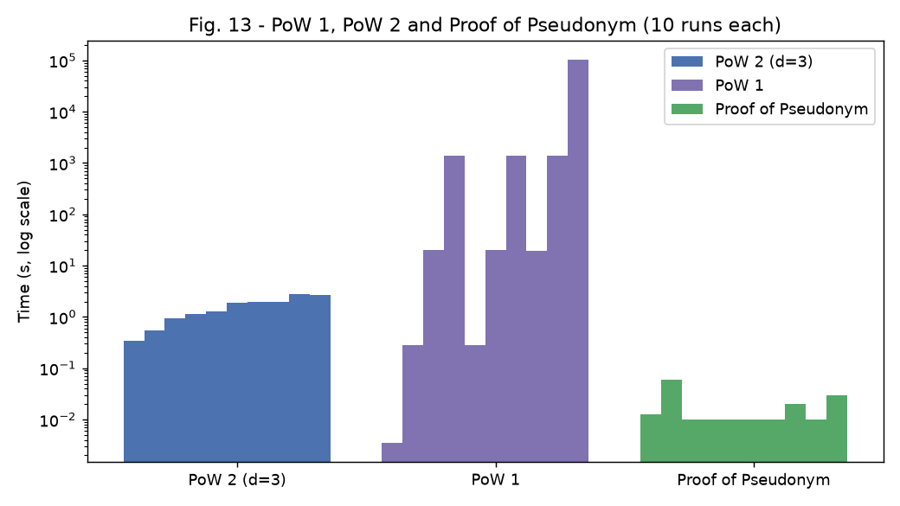
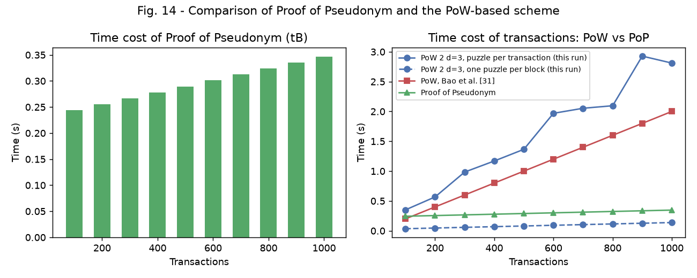
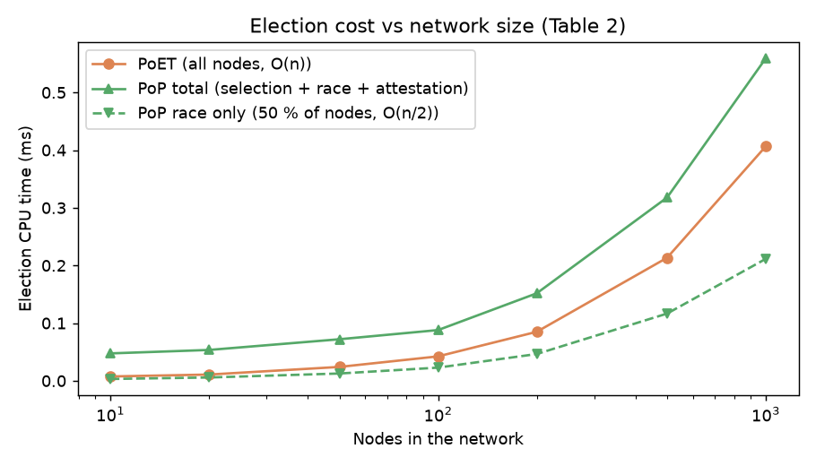
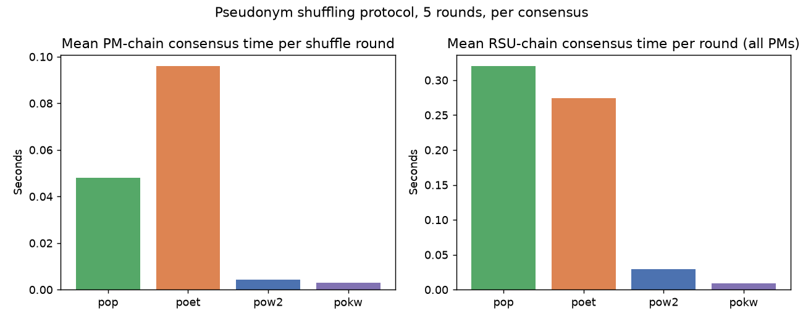

# PoS: Proof of Pseudonym simulation (v1 reproduction and v2 extensions)

A simulation of the protocol proposed in

> S. Johar, N. Ahmad, A. Durrani and G. Ali, "Proof of Pseudonym: Blockchain-Based
> Privacy Preserving Protocol for Intelligent Transport System", *IEEE Access*,
> vol. 9, pp. 163625-163639, 2021. doi:[10.1109/ACCESS.2021.3133423](https://doi.org/10.1109/ACCESS.2021.3133423)

The manuscript proposes a pseudonym *shuffling* scheme for Intelligent Transport
Systems: instead of a central authority minting fresh pseudonyms all the time,
Privacy Managers (PMs) collect the pseudonyms vehicles have used, shuffle them in a
cloud and hand them back out through Road Side Units (RSUs), recording every step
on two levels of private blockchain. The blocks are published with a new consensus,
**Proof of Pseudonym (PoP)**, in which a server randomly selects at least half of the
nodes, only those nodes draw a random short time, and the shortest wins. The paper
compares PoP with Proof of Work (two variants), Proof of Kernel Work and Proof of
Elapsed Time.

This repository implements all of that in Python and re-runs the paper's
experiments (Figures 7 to 14, Table 2) and its security analysis (Section VI).
That is **PoP v1**, the manuscript as published. On top of it, **PoP v2** adds
what the v1 simulation showed was missing: a verifiable serverless election, a
measured (not asserted) unlinkability, demand-aware distribution, anchored
blockchains with cross-PM proofs, a network model with fork analysis and PBFT/Raft
baselines, a Sybil analysis, and a configurable benchmark. See
[docs/pop_v2.md](docs/pop_v2.md) for the design and the "PoP v2 results" section
below for the numbers.

## What is in the box

```
src/pop_sim/
  crypto.py          P-256 key pairs, ECDSA signatures, ECIES-style encryption, SHA-256
  blockchain.py      signed + encrypted transactions, hash-linked blocks, validation hook
  entities.py        PKI, Manufacturer, Vehicle, RSU, Privacy Manager, PM cloud, pseudonym ledger
  consensus/
    pow1.py          Algorithm 1  - Proof of Work 1 (puzzle-string search)
    pow2.py          Algorithm 2  - Proof of Work 2 (leading-zero hash puzzle)
    pokw.py          Proof of Kernel Work
    poet.py          Algorithm 3  - Proof of Elapsed Time
    pop.py           Algorithm 6  - Proof of Pseudonym (server, handshake, >= 50 % selection, signed election)
    popv2.py         PoP v2 - serverless election on a VRF, PKI-bound keys, fork rule
  vrf.py             RSA-FDH-VRF of RFC 9381 (pure Python, CRT)
  shuffle.py         Algorithm 4 (shuffling over the PM cloud) and Algorithm 5 (RSU distribution),
                     plus the v2 options: mobility, forecasting, anchoring, adversary
  block_time.py      tB = nT*tV + 2*tP + tprep + tM*N
  v2/
    network.py       latency/loss model, fork analysis, latency models for 6 consensus algorithms
    mobility.py      ring road, Poisson traffic, CAM beacons
    adversary.py     kinematic tracker across pseudonym changes
    anchoring.py     Merkle roots, RSU-chain anchors in PM blocks, allotment proofs
    sybil.py         Sybil / collusion analysis
  experiments.py     v1: Figures 7-14, scalability, end-to-end protocol runs, security scenarios
  experiments_v2.py  v2: the seven experiments of docs/pop_v2.md
  plots.py, plots_v2.py
  cli.py             `pop-sim run`, `run-v2`, `bench`, `demo`
tests/               36 tests: crypto, chain integrity, every consensus, protocol invariants, attacks, v2
results/, figures/   JSON and PNG of the full v1 run; results/v2 and figures/v2 of the full v2 run
config/benchmark.json  example configuration for `pop-sim bench`
docs/paper_mapping.md  section-by-section mapping from the manuscript to the code, and the deviations
docs/pop_v2.md         what v2 changes, why, and how each change is measured
```

## Quick start

```bash
python -m venv .venv && . .venv/bin/activate
pip install -r requirements-dev.txt
pytest -q                                   # 36 tests
PYTHONPATH=src python -m pop_sim demo       # trace three shuffle rounds (v1)
PYTHONPATH=src python -m pop_sim demo --mobility --consensus popv2   # v2: vehicles drive, VRF election
PYTHONPATH=src python -m pop_sim run --quick     # v1 experiments, small budgets (~15 s)
PYTHONPATH=src python -m pop_sim run             # v1 full budgets (~7 min), writes results/ and figures/
PYTHONPATH=src python -m pop_sim run-v2 --quick  # v2 experiments, small budgets (~20 s)
PYTHONPATH=src python -m pop_sim run-v2          # v2 full budgets (~10 min), writes results/v2 and figures/v2
PYTHONPATH=src python -m pop_sim bench config/benchmark.json   # the protocol from a JSON configuration
```

`pip install -e .` installs the `pop-sim` command so the `PYTHONPATH=src` prefix is not needed.

### Demo output

```
ITS domain: 2 PMs, 6 RSUs, 30 vehicles, 90 pseudonyms, consensus=pop
round 1: 91 msgs (0 rejected), 90 pseudonyms shuffled, PM block by PM-1 (2/2 mining, 30.0 ms), 4 RSU blocks, 0 returned to a previous holder
round 2: 91 msgs (1 rejected), 90 pseudonyms shuffled, PM block by PM-2 (2/2 mining, 60.0 ms), 4 RSU blocks, 0 returned to a previous holder
round 3: 87 msgs (0 rejected), 87 pseudonyms shuffled, PM block by PM-1 (2/2 mining, 200.0 ms), 4 RSU blocks, 0 returned to a previous holder
PM chain: 4 blocks, valid = True
RSU chains: {'PM-1': 8, 'PM-2': 8} valid = True
linkability: {"messages_observed": 267, "pid_reused_by_same_vehicle": 0, "pids_issued": 90, ...}
revocations: [{"vehicle": "VEH-00009-...", "pid": "PID-843f...", "rsu": "RSU-1.2", "reason": "pseudonym-held-by-another-vehicle"}]
```

The one rejected message in round 2 is the configured malicious vehicle replaying a
pseudonym it had already returned; the RSU catches it against the ledger, the PM
reports it and the PKI revokes the vehicle's certificate (its three pseudonyms then
leave the pool, hence 87 messages in round 3).

## How the protocol is simulated

One `ITSSimulation` holds a PKI, `n_pm` Privacy Managers, `rsus_per_pm` RSUs each and
`vehicles_per_rsu` vehicles under every RSU. Set-up follows Algorithm 4 steps 1-9:
the manufacturer provisions each vehicle with a PKI-issued permanent identity, the
PKI generates `pid, cert, pk, sk` for every pseudonym and broadcasts the sets to the
PMs encrypted with the PM's public key and signed with the PKI's key, the PMs serve
their RSUs and the RSUs allot the sets to vehicles. From then on PKI is only touched
again to revoke a certificate (the simulation counts PKI accesses to check this).

Every shuffle round (`run_round`) then does:

1. Vehicles sign safety messages with their pseudonyms, rotating through the set.
   The RSU verifies each message against the **pseudonym ledger** (the state the
   `allot`/`used` transactions of the RSU chain describe): pseudonym must be
   currently allotted to that vehicle, not returned, and the signature must verify.
2. Algorithm 5 lines 7-9: RSUs collect the used pseudonyms together with the
   vehicles' status, record them as a transaction encrypted for the PM, and the
   RSUs of the PM mine the RSU-level chain.
3. Algorithm 4 lines 11-16: PMs collect the packages, upload them to the PM cloud,
   the cloud shuffles everything and relocates sets to PMs by traffic need.
4. Algorithm 4 lines 18-19: the relocations become `shuffle` transactions
   (signed by the origin PM, encrypted for the destination PM); the PMs run the
   consensus and the winner publishes the block on the PM chain. Under PoP, the
   block carries the server-signed election record and every node checks it.
5. Algorithm 4 line 21 and Algorithm 5 lines 1-6: PMs retrieve their new sets,
   RSUs record the allotment, mine, and distribute to vehicles.

The consensus is pluggable (`pop`, `poet`, `pow2`, `pokw`) so the same protocol run
can be compared across algorithms.

## PoP v1 results (the manuscript reproduced)

Numbers below are from `results/` and `figures/`, produced by the full run on the
reference machine recorded in `results/run_info.json` (Python 3.11, x86_64, cloud
container). They are machine dependent; the shapes are what matters.

### Proof of Work 1 (Figures 7 and 8, `results/pow1.json`)

| Puzzle | Guesses | CPU time (s) | Note |
|---|---|---|---|
| 0a | 3,667 | 0.004 | measured |
| 0ab | 256,648 | 0.28 | measured |
| 0abc | 17,965,319 | 20.5 | measured |
| 0abcd | 1.3 x 10^9 | 1,376 | extrapolated |
| 00a | 258,467 | 0.28 | measured |
| 00ab | 18,092,648 | 20.3 | measured |
| 00abc | 1.3 x 10^9 | 1,380 | extrapolated |
| 00gf | 18,093,072 | 19.6 | measured |
| 00gfs | 1.3 x 10^9 | 1,415 | extrapolated |
| 00upha | 9.4 x 10^10 | 101,886 | extrapolated |

Every extra character multiplies the search by the size of the guessing set (70), so
the puzzle, not the hardware, decides the time. The paper reports 0.2 s to 2,018 s for
the same ten puzzles; the ordering is reproduced, the absolute values depend on the
enumeration order (see `docs/paper_mapping.md`).



### Proof of Work 2 (Figures 9 and 10, `results/pow2.json`)

| Transactions | d = 3 (s) | d = 4 (s) |
|---|---|---|
| 100 | 0.34 | 5.1 |
| 500 | 1.31 | 22.4 |
| 1000 | 2.69 | 44.3 |

Linear in the number of transactions and 16x per extra leading zero, as in the paper
(1.6 to 19.5 s and 34 to 286 s on the authors' machine).



### PoET and Proof of Pseudonym elections (Figures 11 and 12, `results/poet.json`, `results/pop.json`)

Ten rounds each. PoET, 10 nodes: winners' random short times 0.01 to 0.07 s. PoP,
20 nodes with the server drawing the miner percentage in [50, 100] every round:
11 to 20 nodes mine, winners' times 0.01 to 0.06 s, the election itself takes
50 to 90 microseconds (2.8 ms in the first round, which includes key set-up). Every
election record verifies against the server's signature.



### Comparison (Figure 13, `results/comparison.json`)

Ten runs of each: PoW 2 at difficulty 3 takes 0.34 to 2.7 s, PoW 1 0.004 to 10^5 s,
Proof of Pseudonym 0.01 to 0.06 s. PoP does not solve a puzzle, so its cost is the
winner's random short time plus a sub-millisecond election.



### Block time (Figure 14, `results/block_time.json`)

`tB = nT*tV + 2*tP + tprep + tM*N` with measured `tV` = 0.115 ms per transaction
(ECDSA P-256 verification), `tP` = 1 ms, measured `tprep`, and 10 nodes (PoP: 5 miners).

| Transactions | PoW 2, puzzle per transaction (s) | PoW 2, one puzzle per block (s) | Proof of Pseudonym (s) | PoW reported by [31] (s) |
|---|---|---|---|---|
| 100 | 0.35 | 0.035 | 0.24 | 0.2 |
| 500 | 1.37 | 0.081 | 0.29 | 1.0 |
| 1000 | 2.81 | 0.138 | 0.35 | 2.0 |

With the paper's measurement model (every transaction hashed to the difficulty) PoP
is 1.4x cheaper than PoW at 100 transactions and 8x cheaper at 1000, which is the
Figure 14 result. If PoW solves a single difficulty-3 puzzle per block, PoW is cheaper
than PoP in this implementation, because PoP's `tM` (46 ms on average) is the random
short time the winner waits, while one difficulty-3 puzzle takes 2 ms here. The
advantage of PoP therefore lies in not scaling with the puzzle difficulty or hardware,
not in beating a trivial puzzle.



### Election cost vs network size (Table 2, `results/scalability.json`)

| Nodes | PoET, all nodes (us) | PoP race, 50 % of nodes (us) | PoP total incl. selection and signed record (us) |
|---|---|---|---|
| 10 | 7 | 3 | 47 |
| 100 | 42 | 23 | 88 |
| 1000 | 407 | 211 | 559 |

The race among half the nodes costs about half of PoET's (the O(n/2) vs O(n) of
Table 2); the server's random selection and the ECDSA signature on the election
record add roughly 40 us plus a per-node shuffle, so the total stays above PoET.



### End-to-end protocol (`results/protocol.json`)

2 PMs, 6 RSUs, 30 vehicles, 3 pseudonyms per vehicle, 5 shuffle rounds, one malicious
vehicle, run once per consensus. In every run: all 90 pseudonyms come back and are
re-allotted each round, no pseudonym is ever handed back to a vehicle that used it,
both blockchain levels validate, the malicious vehicle is caught on its first replay
and revoked, and PKI is accessed 31 times (30 registrations, 1 revocation).

| Consensus | Mean PM-chain consensus per round (s) | Mean RSU-chain consensus per round, both PMs (s) |
|---|---|---|
| Proof of Pseudonym | 0.048 | 0.320 |
| PoET | 0.096 | 0.274 |
| PoW 2 (d = 3, one puzzle per node) | 0.004 | 0.030 |
| PoKW (d = 3, kernel of half the nodes) | 0.003 | 0.009 |

These times include the winner's random wait for PoP and PoET (simulated, not slept),
which is why the two puzzle-free algorithms look slower than a difficulty-3 puzzle on
a tiny network. The protocol itself (signing, encryption, shuffling, ledger checks) runs
in about 0.1 to 0.3 s for the five rounds.



## Security scenarios (Section VI)

`experiments.exp_security` runs each threat and checks the counter-measure
mechanically; `tests/test_protocol.py` asserts them all.

| Threat (manuscript) | What the simulation does | Outcome |
|---|---|---|
| Tampering with the ledger | Changes one byte of a published transaction | Chain validation fails |
| Forged PKI broadcast | Attacker signs a pseudonym package with their own key | PM rejects the package |
| Curious / compromised RSU (Section VI-C) | RSU tries to decrypt a transaction addressed to the PM | AES-GCM authentication fails; the PM can read it |
| Spoofed PM (Section VI-B-3) | A PM that was not elected publishes a block, with the real election record or a self-signed one | Both blocks rejected |
| Internal Tricking Adversary (Section VI-B-2) | A compromised OBU keeps a copy of a used pseudonym and replays it | Flagged by the RSU, reported to the PM, certificate revoked by the PKI; honest vehicles are never flagged |
| Global / Local Passive Adversary (Section VI-B-1) | Eavesdropper collects every safety message over 5 shuffle rounds and tries to link them by pseudonym | 0 of 450 messages link to an earlier message of the same vehicle; every pseudonym passed through several vehicles |
| Single point of failure | PKI access count | Equals the number of vehicles (registration only) plus revocations |

## Honest notes on what the simulation shows and does not show

* PoP's advantage over PoW in the paper comes from not solving a puzzle at all; the
  simulation reproduces that (Figures 13 and 14). Whether PoP is also cheaper than
  PoET depends on what is counted: the race among 50 % of the nodes is about half the
  cost of PoET's race among all nodes (Table 2's O(n/2) vs O(n)), but the server's
  random selection and the signature on the election record add a fixed cost, so the
  total election time of this implementation is above PoET's at every network size
  tested. Both are well under a millisecond for 1000 nodes; the winner's random short
  time (10 to 250 ms) dominates either.
* The random short time is simulated, not slept, except with `real_wait=True`.
* All nodes run in one process; network propagation is the constant `tP` of the formula.
* The PoW 1 numbers for puzzles longer than four characters are extrapolations, see
  `docs/paper_mapping.md`.
* The scheme is reproduced faithfully to the manuscript's algorithms; two additions
  that the manuscript implies but does not spell out (no-return-to-previous-holder
  allotment and the signed election record) are documented in `docs/paper_mapping.md`
  and can be switched off.

## PoP v2 results

V2_RESULTS_PLACEHOLDER

## License

MIT, see `LICENSE`.
