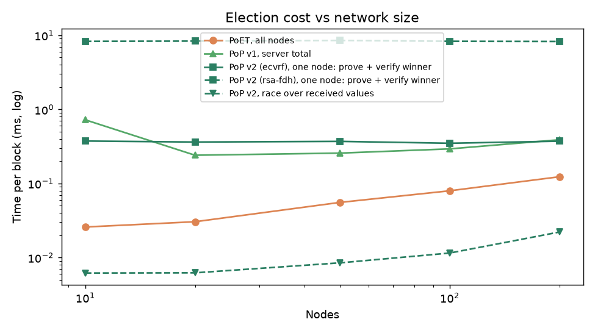
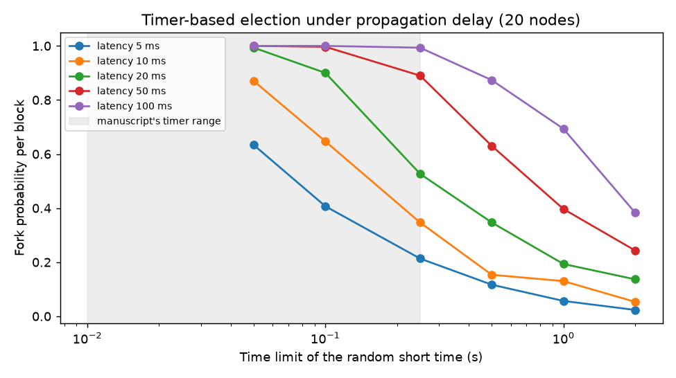
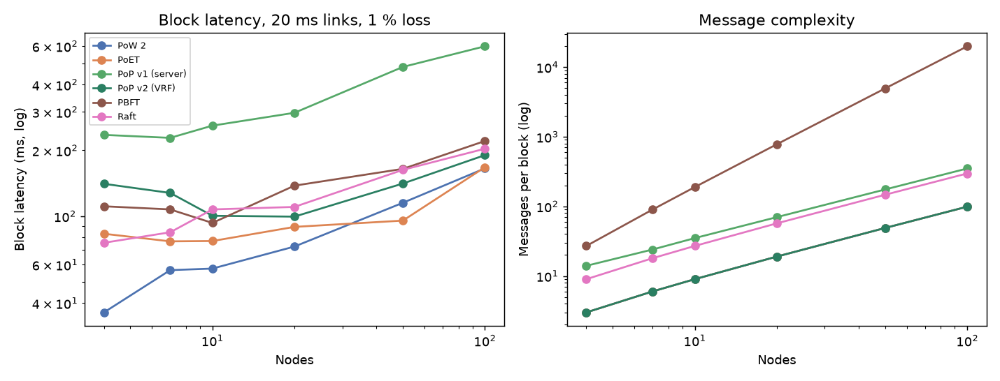
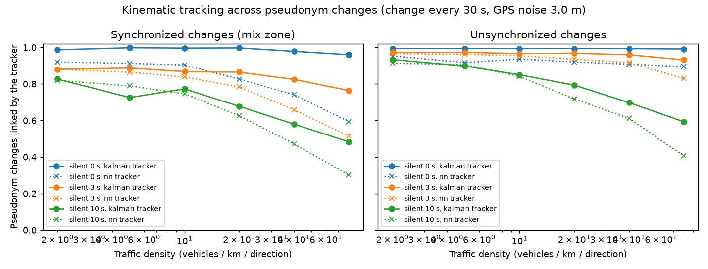
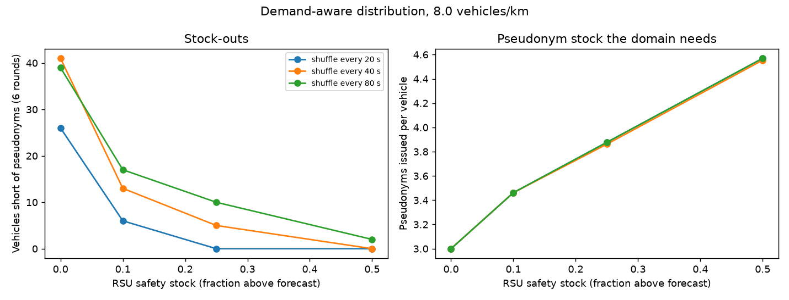
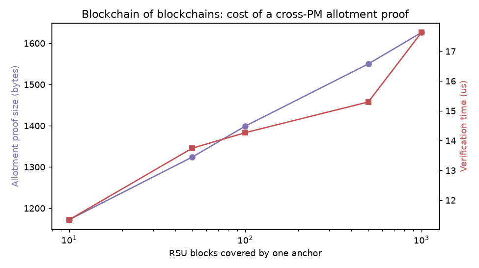
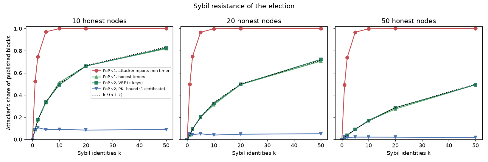
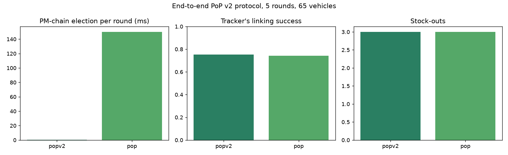
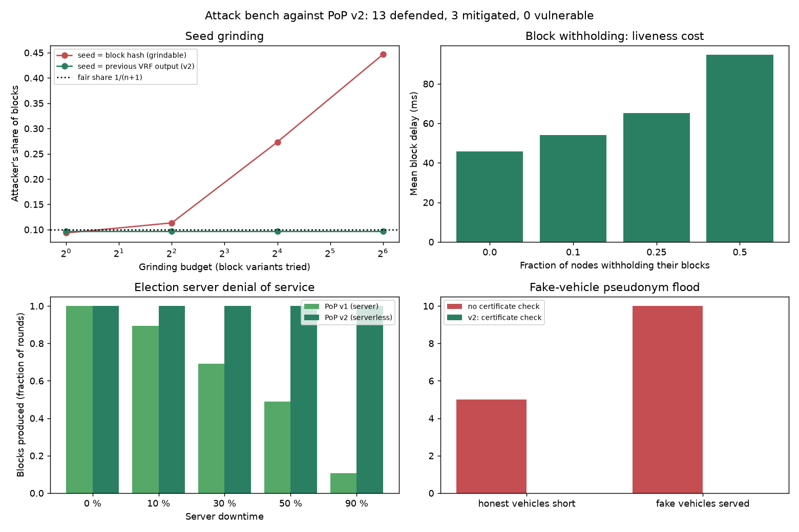
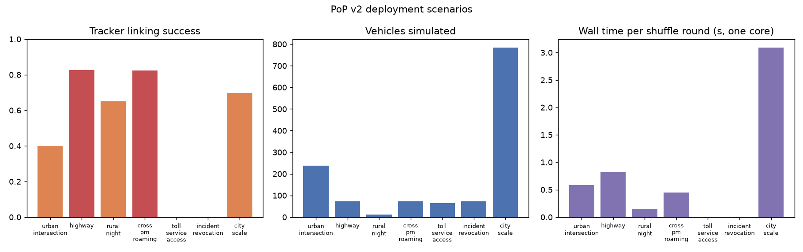

# PoS: Proof of Pseudonym simulation (v1 reproduction and v2 extensions)

A simulation of the protocol proposed in

> S. Johar, N. Ahmad, A. Durrani and G. Ali, "Proof of Pseudonym: Blockchain-Based
> Privacy Preserving Protocol for Intelligent Transport System", *IEEE Access*,
> vol. 9, pp. 163625-163639, 2021. doi:[10.1109/ACCESS.2021.3133423](https://doi.org/10.1109/ACCESS.2021.3133423)

The manuscript proposes a pseudonym *shuffling* scheme for Intelligent Transport
Systems: instead of a central authority minting fresh pseudonyms all the time,
Privacy Managers (PMs) collect the pseudonyms vehicles have used, shuffle them in a
cloud and hand them back out through Road Side Units (RSUs), recording every step
on two levels of private blockchain. The blocks are published with a new consensus,
**Proof of Pseudonym (PoP)**, in which a server randomly selects at least half of the
nodes, only those nodes draw a random short time, and the shortest wins. The paper
compares PoP with Proof of Work (two variants), Proof of Kernel Work and Proof of
Elapsed Time.

This repository implements all of that in Python and re-runs the paper's
experiments (Figures 7 to 14, Table 2) and its security analysis (Section VI).
That is **PoP v1**, the manuscript as published. On top of it, **PoP v2** adds
what the v1 simulation showed was missing: a verifiable serverless election, a
measured (not asserted) unlinkability, demand-aware distribution, anchored
blockchains with cross-PM proofs, a network model with fork analysis and PBFT/Raft
baselines, a Sybil analysis, and a configurable benchmark. See
[docs/pop_v2.md](docs/pop_v2.md) for the design and the "PoP v2 results" section
below for the numbers.

## What is in the box

```
src/pop_sim/
  crypto.py          P-256 key pairs, ECDSA signatures, ECIES-style encryption, SHA-256
  blockchain.py      signed + encrypted transactions, hash-linked blocks, validation hook
  entities.py        PKI, Manufacturer, Vehicle, RSU, Privacy Manager, PM cloud, pseudonym ledger
  consensus/
    pow1.py          Algorithm 1  - Proof of Work 1 (puzzle-string search)
    pow2.py          Algorithm 2  - Proof of Work 2 (leading-zero hash puzzle)
    pokw.py          Proof of Kernel Work
    poet.py          Algorithm 3  - Proof of Elapsed Time
    pop.py           Algorithm 6  - Proof of Pseudonym (server, handshake, >= 50 % selection, signed election)
    popv2.py         PoP v2 - serverless election on a VRF, PKI-bound keys, fork rule
  vrf.py             RSA-FDH-VRF of RFC 9381 (pure Python, CRT)
  shuffle.py         Algorithm 4 (shuffling over the PM cloud) and Algorithm 5 (RSU distribution),
                     plus the v2 options: mobility, forecasting, anchoring, adversary
  block_time.py      tB = nT*tV + 2*tP + tprep + tM*N
  v2/
    network.py       latency/loss model, fork analysis, latency models for 6 consensus algorithms
    mobility.py      ring road, Poisson traffic, CAM beacons
    adversary.py     kinematic tracker across pseudonym changes
    anchoring.py     Merkle roots, RSU-chain anchors in PM blocks, allotment proofs
    sybil.py         Sybil / collusion analysis
    attacks.py       adversarial bench: 16 attacks executed against the implementation
    usecases.py      7 deployment scenarios with operator-facing metrics
  experiments.py     v1: Figures 7-14, scalability, end-to-end protocol runs, security scenarios
  experiments_v2.py  v2: the seven experiments of docs/pop_v2.md
  plots.py, plots_v2.py
  cli.py             `pop-sim run`, `run-v2`, `bench`, `demo`
tests/               53 tests: crypto, chain integrity, every consensus, protocol invariants, v2, attack bench, scenarios
results/, figures/   JSON and PNG of the full v1 run; results/v2 and figures/v2 of the full v2 run
config/benchmark.json  example configuration for `pop-sim bench`
docs/paper_mapping.md  section-by-section mapping from the manuscript to the code, and the deviations
docs/pop_v2.md         what v2 changes, why, and how each change is measured
docs/attacks_and_usecases.md  the attack table and the scenario table
```

## Quick start

```bash
python -m venv .venv && . .venv/bin/activate
pip install -r requirements-dev.txt
pytest -q                                   # 53 tests
PYTHONPATH=src python -m pop_sim demo       # trace three shuffle rounds (v1)
PYTHONPATH=src python -m pop_sim demo --mobility --consensus popv2   # v2: vehicles drive, VRF election
PYTHONPATH=src python -m pop_sim run --quick     # v1 experiments, small budgets (~15 s)
PYTHONPATH=src python -m pop_sim run             # v1 full budgets (~7 min), writes results/ and figures/
PYTHONPATH=src python -m pop_sim run-v2 --quick  # v2 experiments, small budgets (~20 s)
PYTHONPATH=src python -m pop_sim run-v2          # v2 full budgets (~10 min), writes results/v2 and figures/v2
PYTHONPATH=src python -m pop_sim bench config/benchmark.json   # the protocol from a JSON configuration
PYTHONPATH=src python -m pop_sim attacks  [--quick]  # 16 attacks executed against PoP v2 (exit 1 if any succeeds)
PYTHONPATH=src python -m pop_sim usecases [--quick]  # 7 deployment scenarios
```

`pip install -e .` installs the `pop-sim` command so the `PYTHONPATH=src` prefix is not needed.

### Demo output

```
ITS domain: 2 PMs, 6 RSUs, 30 vehicles, 90 pseudonyms, consensus=pop
round 1: 91 msgs (0 rejected), 90 pseudonyms shuffled, PM block by PM-1 (2/2 mining, 30.0 ms), 4 RSU blocks, 0 returned to a previous holder
round 2: 91 msgs (1 rejected), 90 pseudonyms shuffled, PM block by PM-2 (2/2 mining, 60.0 ms), 4 RSU blocks, 0 returned to a previous holder
round 3: 87 msgs (0 rejected), 87 pseudonyms shuffled, PM block by PM-1 (2/2 mining, 200.0 ms), 4 RSU blocks, 0 returned to a previous holder
PM chain: 4 blocks, valid = True
RSU chains: {'PM-1': 8, 'PM-2': 8} valid = True
linkability: {"messages_observed": 267, "pid_reused_by_same_vehicle": 0, "pids_issued": 90, ...}
revocations: [{"vehicle": "VEH-00009-...", "pid": "PID-843f...", "rsu": "RSU-1.2", "reason": "pseudonym-held-by-another-vehicle"}]
```

The one rejected message in round 2 is the configured malicious vehicle replaying a
pseudonym it had already returned; the RSU catches it against the ledger, the PM
reports it and the PKI revokes the vehicle's certificate (its three pseudonyms then
leave the pool, hence 87 messages in round 3).

## How the protocol is simulated

One `ITSSimulation` holds a PKI, `n_pm` Privacy Managers, `rsus_per_pm` RSUs each and
`vehicles_per_rsu` vehicles under every RSU. Set-up follows Algorithm 4 steps 1-9:
the manufacturer provisions each vehicle with a PKI-issued permanent identity, the
PKI generates `pid, cert, pk, sk` for every pseudonym and broadcasts the sets to the
PMs encrypted with the PM's public key and signed with the PKI's key, the PMs serve
their RSUs and the RSUs allot the sets to vehicles. From then on PKI is only touched
again to revoke a certificate (the simulation counts PKI accesses to check this).

Every shuffle round (`run_round`) then does:

1. Vehicles sign safety messages with their pseudonyms, rotating through the set.
   The RSU verifies each message against the **pseudonym ledger** (the state the
   `allot`/`used` transactions of the RSU chain describe): pseudonym must be
   currently allotted to that vehicle, not returned, and the signature must verify.
2. Algorithm 5 lines 7-9: RSUs collect the used pseudonyms together with the
   vehicles' status, record them as a transaction encrypted for the PM, and the
   RSUs of the PM mine the RSU-level chain.
3. Algorithm 4 lines 11-16: PMs collect the packages, upload them to the PM cloud,
   the cloud shuffles everything and relocates sets to PMs by traffic need.
4. Algorithm 4 lines 18-19: the relocations become `shuffle` transactions
   (signed by the origin PM, encrypted for the destination PM); the PMs run the
   consensus and the winner publishes the block on the PM chain. Under PoP, the
   block carries the server-signed election record and every node checks it.
5. Algorithm 4 line 21 and Algorithm 5 lines 1-6: PMs retrieve their new sets,
   RSUs record the allotment, mine, and distribute to vehicles.

The consensus is pluggable (`pop`, `poet`, `pow2`, `pokw`) so the same protocol run
can be compared across algorithms.

## PoP v1 results (the manuscript reproduced)

Numbers below are from `results/` and `figures/`, produced by the full run on the
reference machine recorded in `results/run_info.json` (Python 3.11, x86_64, cloud
container). They are machine dependent; the shapes are what matters.

### Proof of Work 1 (Figures 7 and 8, `results/pow1.json`)

| Puzzle | Guesses | CPU time (s) | Note |
|---|---|---|---|
| 0a | 3,667 | 0.004 | measured |
| 0ab | 256,648 | 0.28 | measured |
| 0abc | 17,965,319 | 20.5 | measured |
| 0abcd | 1.3 x 10^9 | 1,376 | extrapolated |
| 00a | 258,467 | 0.28 | measured |
| 00ab | 18,092,648 | 20.3 | measured |
| 00abc | 1.3 x 10^9 | 1,380 | extrapolated |
| 00gf | 18,093,072 | 19.6 | measured |
| 00gfs | 1.3 x 10^9 | 1,415 | extrapolated |
| 00upha | 9.4 x 10^10 | 101,886 | extrapolated |

Every extra character multiplies the search by the size of the guessing set (70), so
the puzzle, not the hardware, decides the time. The paper reports 0.2 s to 2,018 s for
the same ten puzzles; the ordering is reproduced, the absolute values depend on the
enumeration order (see `docs/paper_mapping.md`).


### Proof of Work 2 (Figures 9 and 10, `results/pow2.json`)

| Transactions | d = 3 (s) | d = 4 (s) |
|---|---|---|
| 100 | 0.34 | 5.1 |
| 500 | 1.31 | 22.4 |
| 1000 | 2.69 | 44.3 |

Linear in the number of transactions and 16x per extra leading zero, as in the paper
(1.6 to 19.5 s and 34 to 286 s on the authors' machine).


### PoET and Proof of Pseudonym elections (Figures 11 and 12, `results/poet.json`, `results/pop.json`)

Ten rounds each. PoET, 10 nodes: winners' random short times 0.01 to 0.07 s. PoP,
20 nodes with the server drawing the miner percentage in [50, 100] every round:
11 to 20 nodes mine, winners' times 0.01 to 0.06 s, the election itself takes
50 to 90 microseconds (2.8 ms in the first round, which includes key set-up). Every
election record verifies against the server's signature.


### Comparison (Figure 13, `results/comparison.json`)

Ten runs of each: PoW 2 at difficulty 3 takes 0.34 to 2.7 s, PoW 1 0.004 to 10^5 s,
Proof of Pseudonym 0.01 to 0.06 s. PoP does not solve a puzzle, so its cost is the
winner's random short time plus a sub-millisecond election.


### Block time (Figure 14, `results/block_time.json`)

`tB = nT*tV + 2*tP + tprep + tM*N` with measured `tV` = 0.115 ms per transaction
(ECDSA P-256 verification), `tP` = 1 ms, measured `tprep`, and 10 nodes (PoP: 5 miners).

| Transactions | PoW 2, puzzle per transaction (s) | PoW 2, one puzzle per block (s) | Proof of Pseudonym (s) | PoW reported by [31] (s) |
|---|---|---|---|---|
| 100 | 0.35 | 0.035 | 0.24 | 0.2 |
| 500 | 1.37 | 0.081 | 0.29 | 1.0 |
| 1000 | 2.81 | 0.138 | 0.35 | 2.0 |

With the paper's measurement model (every transaction hashed to the difficulty) PoP
is 1.4x cheaper than PoW at 100 transactions and 8x cheaper at 1000, which is the
Figure 14 result. If PoW solves a single difficulty-3 puzzle per block, PoW is cheaper
than PoP in this implementation, because PoP's `tM` (46 ms on average) is the random
short time the winner waits, while one difficulty-3 puzzle takes 2 ms here. The
advantage of PoP therefore lies in not scaling with the puzzle difficulty or hardware,
not in beating a trivial puzzle.


### Election cost vs network size (Table 2, `results/scalability.json`)

| Nodes | PoET, all nodes (us) | PoP race, 50 % of nodes (us) | PoP total incl. selection and signed record (us) |
|---|---|---|---|
| 10 | 7 | 3 | 47 |
| 100 | 42 | 23 | 88 |
| 1000 | 407 | 211 | 559 |

The race among half the nodes costs about half of PoET's (the O(n/2) vs O(n) of
Table 2); the server's random selection and the ECDSA signature on the election
record add roughly 40 us plus a per-node shuffle, so the total stays above PoET.


### End-to-end protocol (`results/protocol.json`)

2 PMs, 6 RSUs, 30 vehicles, 3 pseudonyms per vehicle, 5 shuffle rounds, one malicious
vehicle, run once per consensus. In every run: all 90 pseudonyms come back and are
re-allotted each round, no pseudonym is ever handed back to a vehicle that used it,
both blockchain levels validate, the malicious vehicle is caught on its first replay
and revoked, and PKI is accessed 31 times (30 registrations, 1 revocation).

| Consensus | Mean PM-chain consensus per round (s) | Mean RSU-chain consensus per round, both PMs (s) |
|---|---|---|
| Proof of Pseudonym | 0.048 | 0.320 |
| PoET | 0.096 | 0.274 |
| PoW 2 (d = 3, one puzzle per node) | 0.004 | 0.030 |
| PoKW (d = 3, kernel of half the nodes) | 0.003 | 0.009 |

These times include the winner's random wait for PoP and PoET (simulated, not slept),
which is why the two puzzle-free algorithms look slower than a difficulty-3 puzzle on
a tiny network. The protocol itself (signing, encryption, shuffling, ledger checks) runs
in about 0.1 to 0.3 s for the five rounds.


## Security scenarios (Section VI)

`experiments.exp_security` runs each threat and checks the counter-measure
mechanically; `tests/test_protocol.py` asserts them all.

| Threat (manuscript) | What the simulation does | Outcome |
|---|---|---|
| Tampering with the ledger | Changes one byte of a published transaction | Chain validation fails |
| Forged PKI broadcast | Attacker signs a pseudonym package with their own key | PM rejects the package |
| Curious / compromised RSU (Section VI-C) | RSU tries to decrypt a transaction addressed to the PM | AES-GCM authentication fails; the PM can read it |
| Spoofed PM (Section VI-B-3) | A PM that was not elected publishes a block, with the real election record or a self-signed one | Both blocks rejected |
| Internal Tricking Adversary (Section VI-B-2) | A compromised OBU keeps a copy of a used pseudonym and replays it | Flagged by the RSU, reported to the PM, certificate revoked by the PKI; honest vehicles are never flagged |
| Global / Local Passive Adversary (Section VI-B-1) | Eavesdropper collects every safety message over 5 shuffle rounds and tries to link them by pseudonym | 0 of 450 messages link to an earlier message of the same vehicle; every pseudonym passed through several vehicles |
| Single point of failure | PKI access count | Equals the number of vehicles (registration only) plus revocations |

## Honest notes on what the simulation shows and does not show

* PoP's advantage over PoW in the paper comes from not solving a puzzle at all; the
  simulation reproduces that (Figures 13 and 14). Whether PoP is also cheaper than
  PoET depends on what is counted: the race among 50 % of the nodes is about half the
  cost of PoET's race among all nodes (Table 2's O(n/2) vs O(n)), but the server's
  random selection and the signature on the election record add a fixed cost, so the
  total election time of this implementation is above PoET's at every network size
  tested. Both are well under a millisecond for 1000 nodes; the winner's random short
  time (10 to 250 ms) dominates either.
* The random short time is simulated, not slept, except with `real_wait=True`.
* All nodes run in one process; network propagation is the constant `tP` of the formula.
* The PoW 1 numbers for puzzles longer than four characters are extrapolations, see
  `docs/paper_mapping.md`.
* The scheme is reproduced faithfully to the manuscript's algorithms; two additions
  that the manuscript implies but does not spell out (no-return-to-previous-holder
  allotment and the signed election record) are documented in `docs/paper_mapping.md`
  and can be switched off.

## PoP v2 results

Numbers from `results/v2/` and `figures/v2/`, produced by `pop-sim run-v2` on the
same machine as the v1 run (88 s wall time). Each subsection names the item of
[docs/pop_v2.md](docs/pop_v2.md) it measures.

### 1. Verifiable election: what one node pays (`v2_election_cost.json`)

| Nodes | PoET, all nodes (us) | PoP v1, server total (us) | PoP v2, one node: own proof + verify winner (us) | PoP v2, race over received values (us) |
|---|---|---|---|---|
| 10 | 24 | 494 | 7,351 | 16 |
| 100 | 67 | 280 | 7,325 | 29 |
| 200 | 107 | 314 | 7,222 | 38 |

PoP v2's per-node cost is flat in the network size: one RSA-2048 FDH proof
(7.2 ms in pure Python with the CRT; about 1 ms with OpenSSL) and one 0.17 ms
verification. The race itself stays in the tens of microseconds. What v2 buys for
those 7 ms is that nobody can lie about or grind the value and no server exists to
spoof. Key generation is 46 ms per node, once.



### 5. Forks: the manuscript's timer range is unsafe on a real network (`v2_forks.json`)

Fork probability per block, 20 nodes, 50 % participation, log-normal link delay:

| Time limit | 5 ms links | 20 ms links | 100 ms links |
|---|---|---|---|
| 0.1 s | 0.41 | 0.90 | 1.00 |
| 0.25 s (manuscript's maximum) | 0.21 | 0.53 | 0.99 |
| 1 s | 0.06 | 0.19 | 0.69 |
| 2 s | 0.02 | 0.14 | 0.38 |

A node whose timer fires before the winner's block reaches it publishes too. With
the paper's 10 to 250 ms timers and ordinary 20 ms links, more than half of the
blocks fork. The time limit must be a large multiple of the propagation delay, which
makes PoP's block time a network property, not a free parameter. The v2 fork rule
(smaller VRF value wins) resolves forks deterministically, but the wasted blocks
remain.



### 5 and 7. Block latency on the same network, six algorithms (`v2_latency.json`)

20 ms links with 1 % loss, measured costs (ECDSA verify 0.11 ms, VRF prove 7.8 ms,
one difficulty-3 puzzle 2.2 ms), 50 rounds per point:

| Nodes | PoW 2 | PoET | PoP v1 (server) | PoP v2 (VRF) | PBFT | Raft | PBFT messages |
|---|---|---|---|---|---|---|---|
| 10 | 58 ms | 77 ms | 259 ms | 100 ms | 93 ms | 107 ms | 189 |
| 20 | 73 ms | 89 ms | 297 ms | 100 ms | 138 ms | 110 ms | 779 |
| 100 | 165 ms | 167 ms | 599 ms | 190 ms | 221 ms | 204 ms | 19,899 |

PoP v1 is the slowest at every size because of its handshake and selection round
trips with the server. PoP v2 removes those and lands with PBFT and Raft while
sending O(n) messages per block instead of PBFT's O(n^2). PoW 2 at difficulty 3 is
the fastest here because the puzzle is trivial; its cost scales with difficulty and
hardware, the others' do not.



### 2. Measured unlinkability (`v2_linkability.json`)

Fraction of pseudonym changes a kinematic tracker links correctly (pseudonym change
every 30 s, 3 m GPS noise, 300 s of traffic, dead reckoning up to 20 s):

| Vehicles / km / direction | Synchronized, no silence | Synchronized, 3 s silence | Synchronized, 10 s silence | Unsynchronized, 10 s silence |
|---|---|---|---|---|
| 2 | 0.92 | 0.88 | 0.82 | 0.91 |
| 10 | 0.90 | 0.84 | 0.75 | 0.84 |
| 80 | 0.59 | 0.51 | 0.30 | 0.41 |

Changing the pseudonym alone buys almost nothing: on a quiet road nine changes in
ten are linked by position and speed. The scheme protects only where the manuscript
says shuffling should happen, in dense traffic, and only if the changes are
synchronized across vehicles (a mix zone) and followed by a silent period. At 80
vehicles per km with synchronized changes and 10 s of silence the tracker links
30 % and mis-links another 25 %. This is the quantitative form of the paper's
unlinkability claim, and its limit.



### 3. Demand-aware distribution (`v2_demand.json`)

8 vehicles per km (65 vehicles), 6 rounds, stock-outs are vehicles that arrive at a
distribution and find fewer than their 3 sets:

| Shuffle every | Safety stock 0 | 10 % | 25 % | 50 % |
|---|---|---|---|---|
| 20 s | 26 stock-outs | 6 | 0 | 0 |
| 40 s | 41 | 13 | 5 | 0 |
| 80 s | 39 | 17 | 10 | 2 |

Pseudonyms issued per vehicle: 3.0, 3.5, 3.9, 4.6 for the four stock levels. With
the forecast alone a sixth of the vehicles are left short every round; a 25 % safety
stock (about one extra pseudonym per vehicle in the domain) removes stock-outs at a
20 s shuffle period, and 50 % does so at 40 s. Longer shuffle periods need more stock,
and (previous table) give the tracker more time.



### 4. Blockchain of blockchains (`v2_anchoring.json`)

| RSU blocks per anchor | Allotment proof size | Verification |
|---|---|---|
| 10 | 1,173 bytes | 11 us |
| 100 | 1,400 bytes | 12 us |
| 1,000 | 1,626 bytes | 16 us |

A vehicle entering another PM's area carries a 1.2 to 1.6 KB proof (logarithmic in
the anchor's span) that a foreign PM verifies in microseconds from the PM chain
alone. Editing one transaction on an RSU chain, even with the RSU re-hashing its
block, is detected from the PM level in every case.



### 6. Sybil resistance (`v2_sybil.json`)

Attacker's share of published blocks, 20 honest nodes, 2,000 rounds:

| Sybil identities k | PoP v1, attacker reports the minimum timer | PoP v1 honest / PoP v2 with k VRF keys | PoP v2, PKI-bound (one certificate) |
|---|---|---|---|
| 1 | 0.50 | 0.05 | 0.05 |
| 5 | 0.97 | 0.20 | 0.05 |
| 20 | 1.00 | 0.50 | 0.05 |

Random selection does not prevent Sybil attacks: an attacker with k identities
wins k/(n+k) of the blocks, and in v1 a single lying identity wins half of them.
What bounds the attacker is binding the election key to a PKI certificate, which v2
does: then one compromised PM is one identity, at 5 % of the blocks whatever k is.



### End-to-end PoP v2 protocol (`v2_protocol.json`)

2 PMs, 6 RSUs, 65 driving vehicles, 5 rounds of 30 s, 3 s silent period, 3 m GPS
noise, 25 % safety stock, one malicious vehicle; run under the v2 election and, for
reference, the v1 election:

| | PoP v2 (VRF) | PoP v1 (server) |
|---|---|---|
| PM-chain election per round | 7.2 ms | 150 ms (incl. the winner's wait) |
| RSU-chain elections per round, both PMs | 30 ms | 390 ms |
| Every PM block verifies against the certified VRF key | yes | n/a |
| Stock-outs over 5 rounds | 3 | 3 |
| Pseudonym changes linked by the tracker | 78 % | 77 % |
| Allotment proof | 2,150 bytes, 20 us | 1,233 bytes, 11 us |
| Malicious vehicle caught and revoked | yes | yes |

The election change does not alter privacy or distribution (same traffic, same
shuffle); it removes the server and makes every block verifiable at a cost of a few
milliseconds per node.



### What v2 establishes

* The published PoP is not safe to deploy as described: its timer range forks on
  ordinary links, its server is a trusted party, its random time is unverifiable, and
  it is not Sybil-resistant. PoP v2 fixes the last three at about 7 ms per node per
  block and makes the first a measured design constraint.
* Pseudonym shuffling protects location privacy only in dense traffic with
  synchronized changes and silent periods. The simulation gives the curve.
* An RSU needs roughly 25 to 50 % more pseudonyms than its forecast to avoid
  stock-outs, depending on the shuffle period.
* Cross-PM proofs and tamper detection cost a few hundred bytes and microseconds.

## Attack bench (PoP v2 under attack)

`pop-sim attacks` executes sixteen attacks against the implementation and reads
the outcome from what honest nodes accept. It exits non-zero if any attack
succeeds, so CI runs it on every push. Full table and mechanisms in
[docs/attacks_and_usecases.md](docs/attacks_and_usecases.md); raw output in
`results/v2/attacks.json`. Result of the full run: **13 defended, 3 mitigated,
0 vulnerable**.

| Attack | What was tried | Measured outcome |
|---|---|---|
| Value forgery / proof theft | Claim a smaller value, reuse the winner's proof, use an uncertified key, choose the seed | 0 of 4 accepted, honest block accepted |
| Seed grinding | Previous winner tries 1 to 64 block variants to lower its next value | Block-hash seed: share rises from 0.09 to 0.45. Chained VRF seed (v2): stays at 0.10 (fair share 0.10) |
| Block withholding | 0 to 50 % of nodes never publish when they win | 0 attacker blocks; mean block delay 46 ms to 95 ms; no round without a block |
| Equivocation | Two blocks, one proof | Second block rejected, node reported |
| Proof replay | Old proof at a new height | Rejected |
| Election server DoS | Server down 10 to 90 % of the time | v1 produces 89 % to 11 % of its blocks; v2 100 % |
| Sybil election keys | 50 self-generated keys publish blocks | 0 accepted |
| Network partition | Two halves elect for 10 heights | 10 wasted blocks, deterministic convergence on healing |
| Pseudonym replay | 2 OBUs reuse returned pseudonyms | Both revoked, 0 honest vehicles revoked |
| Pseudonym cloning | Copied pseudonym 4 km away one second later, and from another sender | Both rejected (clone check, holder binding) |
| Forged pseudonym / package | Self-minted credentials to RSU and PM | Unknown pseudonym; package rejected |
| Fake-vehicle flood | 30 forged-certificate vehicles at one RSU | Without the check: 10 fakes served, 5 honest vehicles short. With v2's check: 0 and 0, 60 requests refused |
| Revoked vehicle persists | Keeps transmitting, asks for new sets | 0 messages accepted, no new sets |
| RSU chain rewrite | RSU edits a transaction and re-hashes its chain | Detected from the PM-level anchors |
| Curious RSU | Reads neighbours' transactions | 0 of 6 opened |
| Location tracking | Kinematic tracker across changes | Sparse road 91 % linked; dense synchronized zone with 10 s silence 35 %; same zone unsynchronized 47 % |



Four of these defences did not exist before the bench was written and were added
because it found them necessary: the chained VRF seed (grinding), equivocation
detection, the certificate check at allotment (flood), and the ledger clone check.

## Deployment scenarios

`pop-sim usecases` runs the protocol in seven settings an operator might deploy it
in (`results/v2/usecases.json`, configurations included so each can be re-run with
`pop-sim bench`). Linking success is the fraction of pseudonym changes a kinematic
tracker follows; below 0.35 is reported as adequate, above 0.7 as insufficient.

| Scenario | Setting | Vehicles | Linking | Stock-outs | Round (one core) | Verdict |
|---|---|---|---|---|---|---|
| Urban intersection | 2 km, 60 veh/km, 30 km/h, shuffle 20 s, 5 s silence | 237 | 0.40 | 0 | 0.6 s | Partial privacy: the right place to shuffle; 10 s silence would reach adequate |
| Highway | 12 km, 4 veh/km, 110 km/h, shuffle 60 s | 72 | 0.83 | 8 | 0.8 s | Insufficient: tracker follows for 87 s on average; needs silence at entries/exits |
| Rural night | 6 km, 1 veh/km | 11 | 0.65 | 0 | 0.2 s | A lone vehicle is tracked the whole round; shuffling alone does not help |
| Cross-PM roaming | Two PMs on a 6 km ring | 72 | 0.83 | 0 | 0.4 s | 42 crossings; 36 anchored proofs verified (2.2 KB, 24 us); 6 fell back to the ledger |
| Toll / service access | Gantry authenticates by pseudonym | 65 | n/a | n/a | n/a | 63 accepted, 2 revoked rejected, 131 us per check, 0 permanent identities exposed |
| Incident revocation | 3 misbehaving vehicles, 2 PMs | 72 | n/a | n/a | n/a | 3 of 3 revoked within 2 rounds, 0 honest vehicles affected, CRL of 3 |
| City scale | 4 PMs x 5 RSUs, 20 km, 20 veh/km | 784 | 0.70 | 1 | 3.1 s | 11,760 signed CAMs per 30 s round, PM election 8 ms: one core keeps up with a district |



What the scenarios say together: PoP v2 is a good fit where the manuscript places it
(dense urban zones, service access, revocation across operators, roaming between
PMs), and the simulation puts numbers on where it is not enough on its own (sparse,
fast roads), where the operator must add silent periods at junctions or accept that
pseudonym change does not provide location privacy.

## License

MIT, see `LICENSE`.
