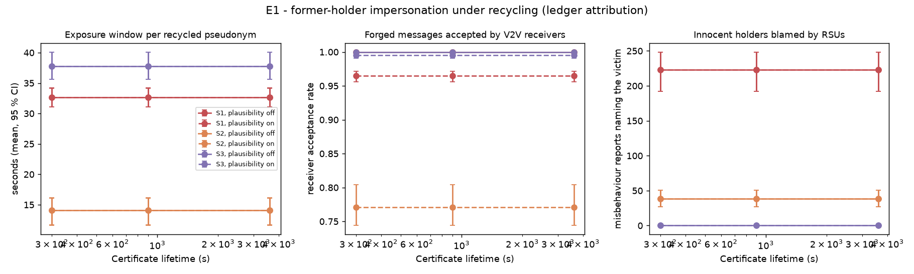
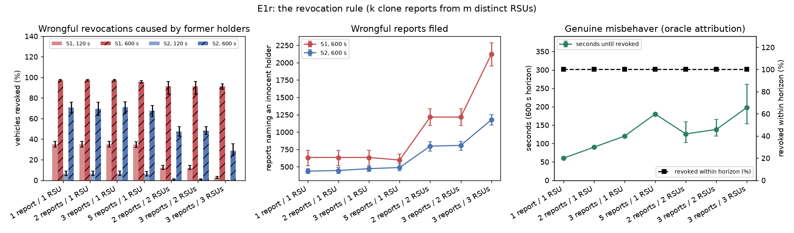
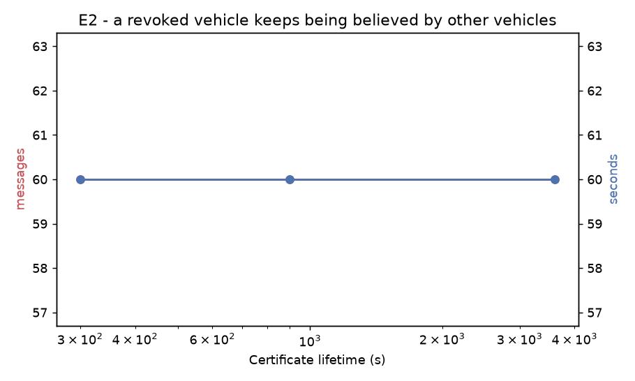
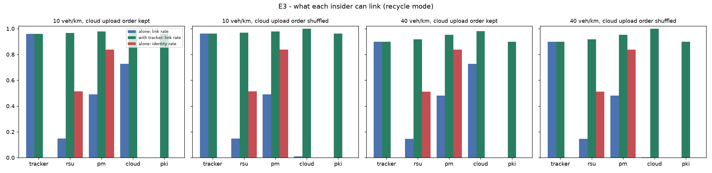
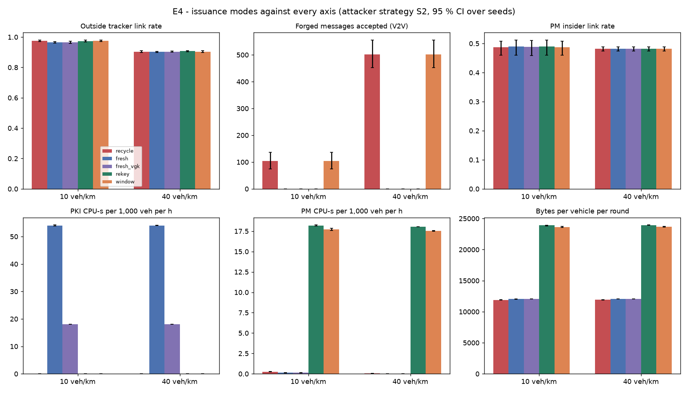
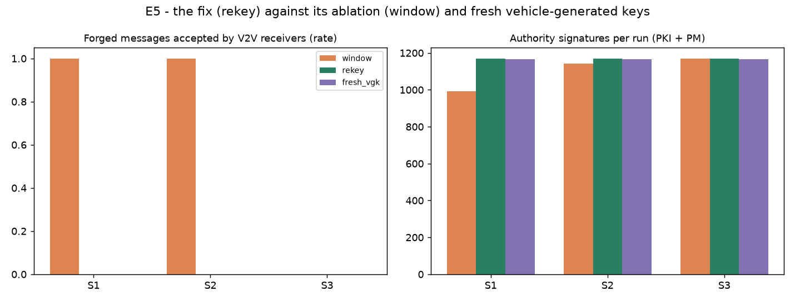
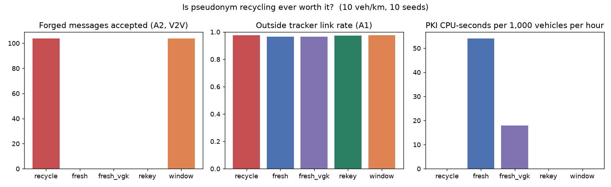
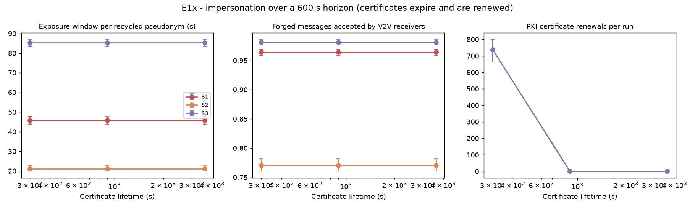
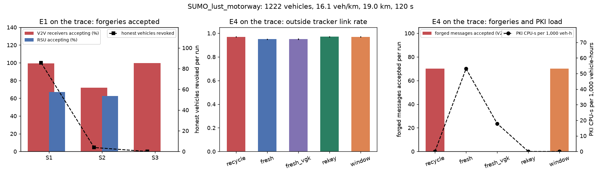
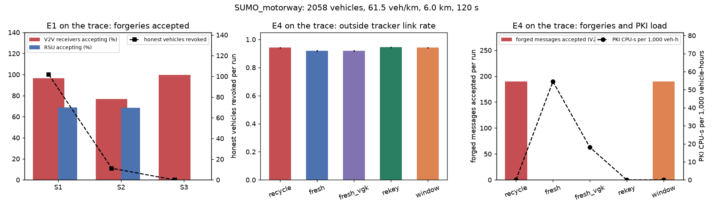

# Pseudonym recycling study: results

Back to the [README](../README.md). Design and pre-registered outcome cases in
[recycling.md](recycling.md). All numbers below come from `results/recycling/*.json`,
produced by `pop-sim recycling` with ten seeds per cell and four rounds of 30 s
(two PMs, six RSUs, 5 km ring road, three pseudonyms per vehicle, 3 s silence after
each change, 3 m GPS noise, ledger attribution, vehicle-to-vehicle receivers within
300 m). Every cell is the mean over seeds with a 95 % bootstrap confidence interval.
The one exception to ledger attribution is E2 (and the misbehaver half of E1r), which
tells the RSU the true sender so that the right vehicle is revoked; it is marked there.

The horizon matters for two results and is stated where it does: 120 s of traffic is
shorter than every certificate lifetime tested, so no certificate expires inside a run.

## E1. A former holder can impersonate the new holder (RQ1)

Five percent of vehicles keep the private key of every pseudonym they held and sign
under those pseudonyms after recycling. Ten vehicles per km unless stated.

| Strategy | Receivers that accept the forgery (plausibility off / on) | RSU accepts | Exposure window per pseudonym (mean, p95) | Innocent holders blamed per run | Honest vehicles revoked per run |
|---|---|---|---|---|---|
| S1 remote shadow | 100 % / 96.5 % | 70 % | 32.6 s, 61 s | 223 | 33 |
| S2 co-located ghost | 100 % / 77 % | 65 % | 14 s, 30 s | 38 | 6 |
| S3 gap filler | 100 % / 99.5 % | 0 % | 38 s, 69 s | 0 | 0 |

* Vehicle-to-vehicle receivers accept every forgery: they check the certificate and
  the signature, and the former holder has both. The local plausibility rule removes
  3.5 % of S1 and 23 % of S2 acceptances, those at receivers that also heard the real
  holder; S3 is untouched because nobody else is using the pseudonym.
* The RSU, which has the ledger, still accepts 65 to 70 % of S1 and S2 forgeries:
  the forger's first message under a pseudonym sets the ledger's last-seen position,
  and from then on the *real* holder is the one that looks cloned.
* That is the accountability failure: under ledger attribution the RSU reports the
  current holder for every clone it detects. S1 produces 223 reports against innocent
  vehicles per run and gets 33 of about 100 honest vehicles revoked; S2 gets 6
  revoked. The attacker itself is never named. These counts are under the
  manuscript's rule, revocation on the first clone report; E1r below varies the rule
  (up to three reports from three distinct RSUs) and the revocations are delayed, not
  prevented.
* Certificate lifetime (300, 900, 3600 s) does not change any of this within the
  horizon: the exposure window is set by the recycling period (how long a pseudonym
  sits with, or between, holders), not by the certificate.
* Density from 2 to 80 vehicles per km and attacker share from 1 to 10 % move the
  counts proportionally and the rates not at all (acceptance 96 to 97 % for S1,
  74 to 77 % for S2, 99.5 % or more for S3).

## E1r. A stricter revocation rule delays the wrongful revocations, it does not prevent them

E1 revokes on the first clone report. `pop-sim recycling --sensitivity` makes the PM
wait for k reports from at least m distinct RSUs before it asks the PKI to revoke
(`revocation_reports`, `revocation_distinct_rsus`), for seven rules, S1 and S2 at
5 % former holders, plausibility on, 900 s certificates, ten seeds, over 120 s and
600 s. The other side of the trade is measured on the E2 vehicle (a genuine
misbehaver replaying its own pseudonyms, oracle attribution): how long the rule lets
it run before it is revoked.

| Rule (reports / distinct RSUs) | Honest vehicles revoked by S1, 120 s / 600 s | by S2, 120 s / 600 s | Wrongful reports, S1, 600 s | Genuine misbehaver revoked after (600 s horizon) |
|---|---|---|---|---|
| 1 / 1 (E1) | 33 / 94 | 6 / 67 | 634 | 60 s |
| 2 / 1 | 33 / 94 | 6 / 66 | 634 | 90 s |
| 3 / 1 | 33 / 94 | 6 / 68 | 634 | 120 s |
| 5 / 1 | 33 / 92 | 6 / 64 | 597 | 180 s |
| 2 / 2 | 12 / 88 | 1 / 45 | 1,216 | 126 s (102 to 159) |
| 3 / 2 | 12 / 88 | 1 / 46 | 1,216 | 138 s (120 to 165) |
| 3 / 3 | 2 / 88 | 0 / 27 | 2,123 | 198 s (153 to 261) |

Of 97 vehicles per run on average: the 600 s S1 figure is 97 % of them under the
first-report rule and 91 % under the three-RSU rule.

* Counting reports changes nothing. A shadowed holder is reported on every message
  the forger sends under its pseudonym, so five reports arrive in the same round as
  the first; the 120 s and 600 s counts are identical from one to five reports.
* Requiring distinct RSUs slows it down: three RSUs cut S1's wrongful revocations at
  120 s from 33 to 2. At 600 s they are back to 88 of 97, because the victim
  drives past more RSUs and each one that hears the forger reports it. The rule
  delays the wrongful revocation by the time it takes to pass two more RSUs.
* The wrongful reports grow with the stricter rule (634 to 2,123 per run): the
  victims that are not yet revoked keep being reported.
* The price on the other side: the genuine misbehaver, revoked 60 s into the run
  under the first-report rule, runs for 198 s (up to 261 s) under the three-RSU rule,
  and is still caught within 600 s at every seed. So the strictest rule tested buys a
  delay for both the victim and the attacker, and nothing else.

The headline numbers of E1 (33 revoked in 120 s, 94 in 600 s) are therefore the
first-report rule's; under the strictest rule tested they are 2 and 88. The failure
is in the attribution, not in the threshold: no count of reports naming the wrong
vehicle makes them name the right one.

## E2. Revocation does not reach other vehicles (RQ2)

One vehicle replays the pseudonyms it has already used. The first replay is only
possible in round 2, so the RSU catches it there and it is revoked after round 2, 60 s
into the 120 s run. It keeps transmitting from the copies it kept. For every lifetime
tested, other vehicles accept all 60 of its later messages for the remaining 60 s of
the run: revocation lives in the ledger and the CRL, which V2V receivers never consult,
and the certificates it holds stay valid until they expire (longer than the run in
every cell).

E2 is run under *oracle* attribution (the RSU is told the true sender), unlike the rest
of the page, so that the misbehaving vehicle itself is the one revoked. Under ledger
attribution its replay would be attributed to the pseudonym's current holder, which is
the E1 and E6 failure, and the question E2 asks (does a revocation reach the vehicles?)
would not even be posed.

## E3. What each insider can link (RQ3)

Recycle mode, ten seeds. Link rate is the share of a vehicle's pseudonym changes the
entity joins correctly; identity rate is the share of vehicles whose cluster carries a
permanent identity; coverage is the share of a vehicle's driven seconds attributed to
its largest cluster.

| Entity | Link rate (10 / 40 veh/km) | Precision | Identity rate | Coverage |
|---|---|---|---|---|
| Outside tracker (A1) | 0.96 / 0.90 | 0.92 / 0.73 | 0 | 0.91 / 0.79 |
| One RSU | 0.15 | 1.00 | 0.52 | 0.22 |
| One PM | 0.49 | 1.00 | 0.84 | 0.53 |
| Cloud, upload order kept | 0.73 | 1.00 | 0 | 0.25 |
| Cloud, order shuffled before upload | 0.01 / 0.002 | 0.01 | 0 | 0.09 |
| PKI | 0 | 1.00 | 0 | 0.08 |
| Tracker + one PM (A4) | 0.98 / 0.95 | 0.80 / 0.21 | 0.84 | 0.95 / 0.90 |
| Tracker + cloud (order kept) | 0.99 / 0.98 | 0.78 / 0.16 | 0 | 0.96 / 0.93 |

* A single PM already names the owner of 84 % of the vehicles in its domain, by
  construction of the ledger. With the tracker it attributes 95 % of every vehicle's
  driving to a named owner. The ledger, not the recycling, creates this exposure: the
  same numbers hold in every issuance mode (E4).
* The cloud-order leak is real: because `RSU.collect_used` returns one vehicle's
  pseudonyms consecutively and the PM uploads in that order, the cloud links 73 % of
  changes with perfect precision before it shuffles anything. Shuffling at the PM
  before upload (`shuffle_before_upload=True`, one line) removes it (1 %).
* Collusion precision falls at 40 vehicles per km (0.21 for tracker + PM): the
  tracker's wrong links merge the PM's correct clusters into larger wrong ones. A
  careful colluder would weight the ledger's edges above the tracker's.

## E4. Issuance modes against every axis (RQ4)

Attacker strategy S2, plausibility on, 900 s certificates, ten paired seeds.

| Axis | recycle | fresh | fresh_vgk | rekey | window |
|---|---|---|---|---|---|
| Outside tracker link rate, 10 veh/km | 0.975 | 0.966 | 0.965 | 0.974 | 0.975 |
| Outside tracker link rate, 40 veh/km | 0.904 | 0.902 | 0.903 | 0.907 | 0.904 |
| Forged messages accepted (V2V), 10 / 40 veh/km | 104 / 502 | 0 / 0 | 0 / 0 | 0 / 0 | 104 / 502 |
| Innocent holders blamed, 10 / 40 veh/km | 38 / 172 | 0 | 0 | 0 | 38 / 172 |
| PM insider link rate | 0.49 | 0.49 | 0.49 | 0.49 | 0.49 |
| PKI CPU-s per 1,000 veh per h (steady state) | 0 | 54 | 18 | 0 | 0 |
| PM CPU-s per 1,000 veh per h | 0.3 | 0.1 | 0.1 | 18 | 18 |
| PKI signatures per run, 10 / 40 veh/km | 0 | 1,164 / 4,697 | 1,158 / 4,688 | 0 | 0 |
| PM signatures per run, 10 / 40 veh/km | 16 | 8 | 8 | 1,170 / 4,703 | 1,141 / 4,566 |
| Vehicle key generations per vehicle per round | 0 | 0 | 3 | 3 | 0 |
| Bytes per vehicle per round | 11.9 k | 12.0 k | 12.1 k | 23.9 k | 23.6 k |
| Stock-outs per run | 0.9 | 1.3 | 0 | 1.5 | 0.9 |

Paired Wilcoxon signed-rank tests (ten seeds, same traffic in every mode, exact
two-sided p-values from the 1,024 sign patterns): forged acceptances recycle vs
fresh, fresh_vgk and rekey, p = 0.002 with effect size 1.0 at both densities (all ten
pairs one way, the smallest p ten pairs can give); PKI load recycle vs fresh and
fresh_vgk, p = 0.002; tracker link rate recycle vs fresh at 10 veh/km, p = 0.006 with
recycle *higher* by 0.9 points (nine of ten pairs), and no significant difference at
40 veh/km (p = 0.43). Version 3.0.0 reported these with the normal approximation
(0.005 and 0.009); the cells themselves are unchanged.

Reading it against the pre-registered cases:

1. **A1 linkability is equal across modes** (within a point; recycling is if
   anything slightly worse). Recycling buys no privacy against an eavesdropper.
2. **A2 forgeries are non-zero only under recycle and window.** Fresh, fresh_vgk
   and rekey are at zero across ten seeds and two densities.
3. **The PKI load of fresh issuance is 54 CPU-seconds per 1,000 vehicles per hour**
   (18 with vehicle-generated keys), against the pre-registered threshold of one. The
   literal threshold of case 1 is not met: at 30 s rounds with three pseudonyms per
   vehicle, fresh issuance is 360 certificates per vehicle-hour, 1.5 % of one core
   per 1,000 vehicles, 15 cores for a million vehicles. Recycling's steady-state PKI
   cost inside the horizon is zero because no certificate came up for renewal; at the
   lifetime scale it is one signature per circulating pseudonym per lifetime, about
   four per vehicle-hour for 3,600 s certificates, roughly a hundredth of fresh
   issuance.
4. **Safe recycling is fresh issuance with the signing moved to the PMs.** `rekey`
   costs the PMs 18 CPU-s per 1,000 vehicle-hours, exactly fresh_vgk's PKI cost, the
   same three key generations per vehicle per round, and twice the bytes per message
   (the holder certificate rides along; a digest after first sight would recover
   that). The pseudonym label it keeps adds nothing measurable.

So the outcome is case 2 with case 3 as the headline: recycling earns its place only
as a load shift, and in exchange it breaks accountability (E1: the ledger blames the
victim) and makes revocation unenforceable at vehicles (E2).

## E5. The fix and its ablation (RQ4)

Ten vehicles per km, 900 s certificates, plausibility off (the receiver's weakest
setting), ten seeds. `window` binds the recycled pseudonym to a holder window but
keeps the shared key; `rekey` also gives each holder a fresh key; `fresh_vgk` issues
fresh pseudonyms with vehicle-generated keys.

| Variant | S1 forgeries sent / accepted | S2 sent / accepted | S3 sent / accepted | Innocent holders blamed (S1 / S2) | PM signatures per run | Vehicle key generations per vehicle per round | Bytes per vehicle per round |
|---|---|---|---|---|---|---|---|
| window | 739 / 739 | 104 / 104 | 471 / 0 | 223 / 38 | 990 to 1,170 | 0 | 22 to 24 k |
| rekey | 926 / 0 | 117 / 0 | 471 / 0 | 0 / 0 | 1,170 | 3 | 24 k |
| fresh_vgk | 0 / 0 | 0 / 0 | 0 / 0 | 0 / 0 | 8 | 3 | 12 k |

* The window alone stops only the gap filler (S3): a former holder cannot present a
  certificate for a time when it did not hold the pseudonym. It stops nothing else,
  because the current holder's window certificate is public (it rides in every
  message) and the former holder still has the key it binds.
* Re-keying stops all three strategies at every seed, and with it the wrongful
  reports: zero innocent holders blamed.
* Its cost against fresh vehicle-generated keys: the same three key generations per
  vehicle per round, the same number of signatures (moved from the PKI to the PMs),
  and twice the bytes per message, because the holder certificate has to travel with
  each message until receivers cache it. Nothing is left that the recycled label
  buys.

## E6. The attack bench under ledger attribution

The eighteen attacks of `pop-sim attacks` rerun with `attribution="ledger"` instead
of the oracle attribution v2.2.1 used. One outcome changes: *revoked vehicle keeps
transmitting* goes from defended to vulnerable. Under ledger attribution the
malicious vehicle's replay is attributed to the pseudonym's current holder, so the
honest holder is revoked and the attacker is not; it then keeps its pseudonyms and
keeps transmitting. The other seventeen outcomes are unchanged (13 defended, 4
mitigated). The bench's default stays oracle so that the v2.2.1 numbers remain
reproducible, and this finding is reported here rather than hidden by the default.

One of the unchanged outcomes needs a word, or it reads as a contradiction of E1. The
bench's *pseudonym replay* attack stays defended under ledger attribution only because
the replay is caught while the attacker still holds the pseudonym: the ledger's holder
*is* the attacker, so the report names the right vehicle. The replay that matters
under recycling is the one made after the pseudonym has moved to someone else, and
that is what E1 measures: there the ledger's holder is the victim, and the report
names the victim.

## The answer

The pre-registered outcome is case 2 with case 3 as the headline (the cases are
defined in [recycling.md](recycling.md)): recycling wins on one axis, authority load,
ties on privacy, and costs two properties the manuscript promises:

* **Privacy against an eavesdropper**: no better than fresh issuance (E4; one point
  worse at 10 veh/km).
* **Security**: a former holder forges accepted messages under every strategy (E1),
  and the ledger-based accountability turns those forgeries into revocations of the
  innocent current holder (E1, E6); a stricter revocation rule only delays them (E1r).
  Fresh issuance has nothing to forge. Both hold on real SUMO traces.
* **Revocation**: unenforceable at vehicles for as long as the certificates live (E2),
  which is a property of certificate lifetime, not of recycling, but recycling makes
  the key a shared secret so the damage spreads to every past holder.
* **Authority load**: the only axis recycling wins. Fresh issuance costs the PKI 54
  CPU-seconds per 1,000 vehicle-hours at 30 s rounds (18 with vehicle-generated
  keys); recycling costs it a signature per circulating pseudonym per certificate
  lifetime. If that load matters, the safe form of recycling (`rekey`) delivers it
  by making the PMs do the signing, at which point it is fresh issuance by another
  authority with a bigger message.
* **Insider exposure** is the same in every mode: the ledger, not the recycling,
  lets a PM name 84 % of its vehicles, and the cloud's upload order leaks 73 % of
  the pseudonym changes until the PM shuffles before uploading (E3).

## E1x and E2x. The longer horizon: certificates expire, and it changes nothing

`pop-sim recycling --long` reruns E1 (plausibility on, 5 % attackers, 10 veh/km) and
E2 over 600 s, twenty rounds, so that 300 s certificates expire and are renewed
inside the run (739 PKI renewals per run at that lifetime; none at 900 or 3,600 s).

| Strategy | Receivers accepting the forgery, lifetime 300 / 900 / 3,600 s | Exposure window, mean / p95 | Innocent holders blamed | Honest vehicles revoked (of about 100) |
|---|---|---|---|---|
| S1 remote shadow | 96.4 % / 96.4 % / 96.4 % | 46 s / 101 s | 634 | 94 |
| S2 co-located ghost | 77.1 % / 77.1 % / 77.1 % | 21 s / 49 s | 437 | 67 |
| S3 gap filler | 98.1 % / 98.1 % / 98.1 % | 85 s / 177 s | 0 | 0 |

A revoked vehicle is believed by other vehicles for all of the remaining 540 s at
every lifetime (E2x), and no honest message is rejected for expiry at any lifetime.

The certificate lifetime does not bound the former holder at all. When a recycled
pseudonym's certificate is renewed, the renewed certificate is public (it rides in
every message of the current holder) and the key it certifies is the one the former
holder still has, so renewal re-arms the attacker along with the holder. Shortening
the lifetime only costs the PKI signatures. The only renewal that would end a former
holder's access is one bound to a key the former holder does not have, which is the
`rekey` design of E5. Over the longer horizon S1 gets 94 of about 100 honest vehicles
revoked per run: ledger-based accountability under recycling does not degrade
gracefully, it collapses.

## E1 and E4 on two SUMO scenarios

`pop-sim recycling-sumo` reruns the E1 core cell (plausibility on, 900 s certificates,
5 % of the trace's vehicles are former holders) and E4 (all modes, S2, paired over ten
seeds) on floating-car traces from Eclipse SUMO 1.28.0, mapped onto the corridor
described in [recycling.md](recycling.md). The trace fixes the traffic; the seeds vary
the keys, which vehicles are former holders, and the GPS noise. Per-vehicle loads are
normalised by the vehicles on the corridor each second.

| Scenario | Corridor | Vehicles seen in 120 s (present per second) | Density | Mean speed |
|---|---|---|---|---|
| LuST motorway (Luxembourg, 08:00, Codeca et al.) | 19.0 km, one carriageway, 33 edges, 3 to 4 lanes | 439 (283) | 16.1 veh/km | 30.9 m/s |
| netgenerate motorway, 3,400 veh/h per direction | 6.0 km, two carriageways on one axis | 584 (372) | 61.5 veh/km of corridor | 30.8 m/s |

E1 (61 former holders on LuST, 103 on the motorway):

| Scenario, strategy | Receivers accepting the forgery | RSU accepting | Exposure window, mean / p95 | Innocent holders blamed | Honest vehicles revoked in 120 s |
|---|---|---|---|---|---|
| LuST, S1 remote shadow | 99.3 % | 67 % | 28 s / 63 s | 569 | 86 of 439 (78 to 94) |
| LuST, S2 co-located ghost | 71.8 % | 63 % | 17 s / 21 s | 26 | 4 |
| LuST, S3 gap filler | 99.8 % | 0 % | 32 s / 58 s | 0 | 0 |
| Motorway, S1 | 96.6 % | 69 % | 27 s / 57 s | 619 | 102 of 584 (88 to 116) |
| Motorway, S2 | 76.7 % | 68 % | 9 s / 22 s | 59 | 11 |
| Motorway, S3 | 99.6 % | 0 % | 28 s / 49 s | 0 | 0 |

E4:

| Scenario, mode | Tracker link rate | Forged messages accepted | Innocent holders blamed | PKI CPU-s per 1,000 veh-h | PM CPU-s per 1,000 veh-h | Bytes per vehicle per round | Allotment stock-outs per run |
|---|---|---|---|---|---|---|---|
| LuST, recycle | 0.970 | 70 | 26 | 0 | 0.1 | 10.5 k | 44 |
| LuST, fresh | 0.950 | 0 | 0 | 53.1 | 0 | 10.8 k | 2 |
| LuST, fresh_vgk | 0.951 | 0 | 0 | 17.9 | 0 | 10.8 k | 0 |
| LuST, rekey | 0.970 | 0 | 0 | 0 | 17.2 | 21.3 k | 48 |
| LuST, window | 0.970 | 70 | 26 | 0 | 17.2 | 21.3 k | 44 |
| Motorway, recycle | 0.942 | 190 | 59 | 0 | 0.1 | 10.0 k | 124 |
| Motorway, fresh | 0.920 | 0 | 0 | 54.5 | 0 | 10.6 k | 2 |
| Motorway, fresh_vgk | 0.920 | 0 | 0 | 18.1 | 0 | 10.6 k | 0 |
| Motorway, rekey | 0.945 | 0 | 0 | 0 | 16.5 | 20.3 k | 137 |
| Motorway, window | 0.942 | 190 | 59 | 0 | 16.5 | 20.3 k | 124 |

* The picture is the ring's. Receivers accept 97 to 100 % of S1 and S3 forgeries and
  72 to 77 % of S2's; the RSU accepts two thirds of S1 and S2; the ledger blames the
  innocent holder hundreds of times per run and S1 gets a fifth of the vehicles seen
  revoked in two minutes. Fresh, fresh_vgk and rekey have zero forgeries and zero
  wrongful reports on both traces (p = 0.002, all ten pairs).
* The PKI cost of fresh issuance is the same as on the ring once normalised by the
  vehicles on the road: 53 to 55 CPU-s per 1,000 vehicle-hours, 18 with
  vehicle-generated keys; `rekey` moves 17 CPU-s to the PMs and doubles the bytes.
* One difference: on a trace the tracker links recycle two points *better* than
  fresh (0.970 vs 0.950 and 0.942 vs 0.920, p = 0.002, all ten pairs), where the ring
  showed one point. The modes that draw on the recycled supply (recycle, rekey,
  window) run out of stock when vehicles keep entering the corridor (44 to 137
  allotment requests per run that an RSU could not serve, against 0 to 2 for fresh
  issuance), and those are the modes with the higher link rate; whether the
  stock-outs cause the difference was not isolated here. In no case does recycling
  come out more private than fresh issuance.

## Limitations

* E1 to E6 use 120 s horizons, inside which no certificate expires; E1x and E2x
  (600 s) cover expiry and renewal and show the lifetime axis is flat for a reason,
  not for lack of horizon.
* Ring road, no intersections (the tracker's easiest case) and a tracker that is
  strong but not optimal; both bias the privacy numbers in the same direction for
  every mode, so the mode comparison stands.
* One attacker model per run; mixed strategies and adaptive attackers are not run.
* Two SUMO scenarios, both motorways (the LuST morning-peak corridor and a
  netgenerate motorway). No urban scenario: the road model is one-dimensional, so a
  corridor through intersections would discard the turning traffic; LuST and MoST
  city centres are not run.
* The revocation rule is varied (E1r) but the detection side is not: every clone
  the ledger sees is reported, with no detector noise.
